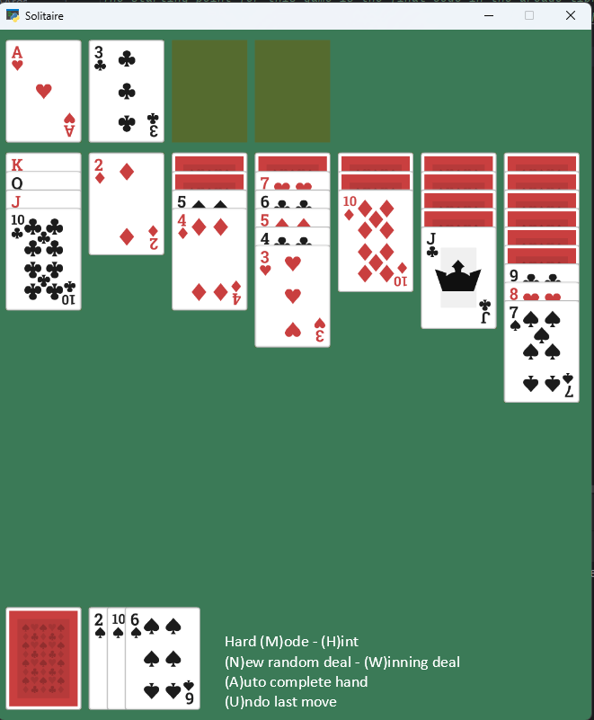

# Solitaire
Solitaire card game written in Python using the Arcade library

The starting point for this game is the final code in the arcade library Solitaire tutorial that can be found here:

https://api.arcade.academy/en/development/tutorials/card_game/index.html

This is © Copyright 2024, Paul Vincent Craven.

I have extended the code to add the following:

- The mat has been resized so that it is hidden when cards are present on it.
- The mat size in the PLAY_PILEs are resized as cards are added and removed so that a card may be dropped anywhere on the pile.
- Added game logic so that the game rejects any invalid moves.
- Auto turn over the top card of the PLAY_PILE when all face up cards are moved from it.
- Added 1 level of undo
- Added easy and hard game modes - press M to change. Easy = one card is turned over at a time Hard = 3 cards are turned over at a time.
- In hard mode, the value of the 3 cards turned over are now shown.
- Added code to automate the running of the game. This can be used to auto complete the current hand. It is intended for use once you know you are in a winning position and would just like the computer to finish the game so you do not have to move all the cards to the top piles.
- Added a game won check to see if all cards are in the top piles. If they are the cards are animated to clear the screen and a new game initiated.
- Added a check to warn you if there are possibly no more valid moves.
- Added instructions at the foot of the screen.
- Added hints - press H and the system will outline any card that has a valid move.
- Added a routine to automate the playing of the game and generate a file of winning hands:
  - In easy mode approximately 1 in 4 random deals are winning deals.
  - In hard mode it reduces to about 1 in 15.
  - 2 files are included containing 300 easy winning deals and 100 hard.
  - Pressing G (not shown on screen) will automate the running of the game using randon deals and add all winning deals found to the appropriate file. The number of deals to be found is set by default to 100 in the constant NUMBER_WINNING_DEALS.
- Any random deal played that is a winning deal is automatically added to the appropriate winning deal file.
- Pressing W will abandon the current deal (animating removing the cards from the screen) and select to play a random winning deal from the file based on the current mode of play.
- Pressing N will abandon the current deal (animating removing the cards from the screen) and generate a random deal to play.
- Centered the play window on the display

    Author Paul Brace
    paul.brace@gmail.com
    March 2025